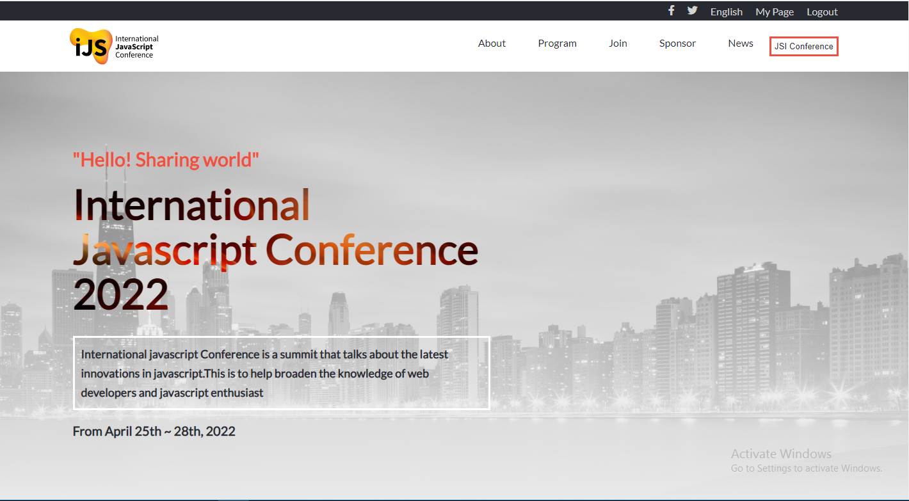

# Conference Website (Module one capstone project)

> This project is a tech conference website that is aimed at bringing developers from all around the globe together. Users will be able to view the date and location of the event, access guest speaker's informaton and get information about upcoming events.

## Built With

- HTML
- CSS
- JAVASCRIPT

## Live Demo
[Live Demo Link](https://devtiwo.github.io/Capstone-1/index.html)

## Getting Started
- clone the repository by running\
    `git clone https://github.com/Devtiwo/Capstone-1.git`

- navigate to the folder\
    `cd Capstone-1`

## Authors

👤 Taiwo Adetunji

- [GitHub](https://github.com/Devtiwo)
- [Twitter](https://twitter.com/devtiwo)
- [LinkedIn](https://www.linkedin.com/in/taiwo-adetunji-860666225/)

## 🤝 Contributing

Contributions, issues, and feature requests are welcome!

Feel free to check the [issues page](https://github.com/Devtiwo/Capstone-1/issues).

## Show your support

Give a ⭐️ if you like this project!

## Acknowledgement

- Design and inspiration by [Cindy Shin on Behance](https://www.behance.net/gallery/29845175/CC-Global-Summit-2015).
- Thanks to [Microverse](www.microverse.org)  and all the staff

## 📝 License

This project is MIT licensed.
